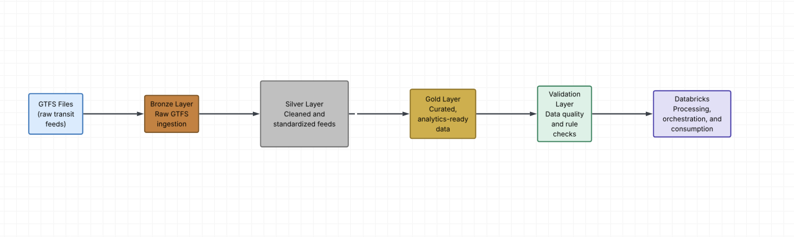
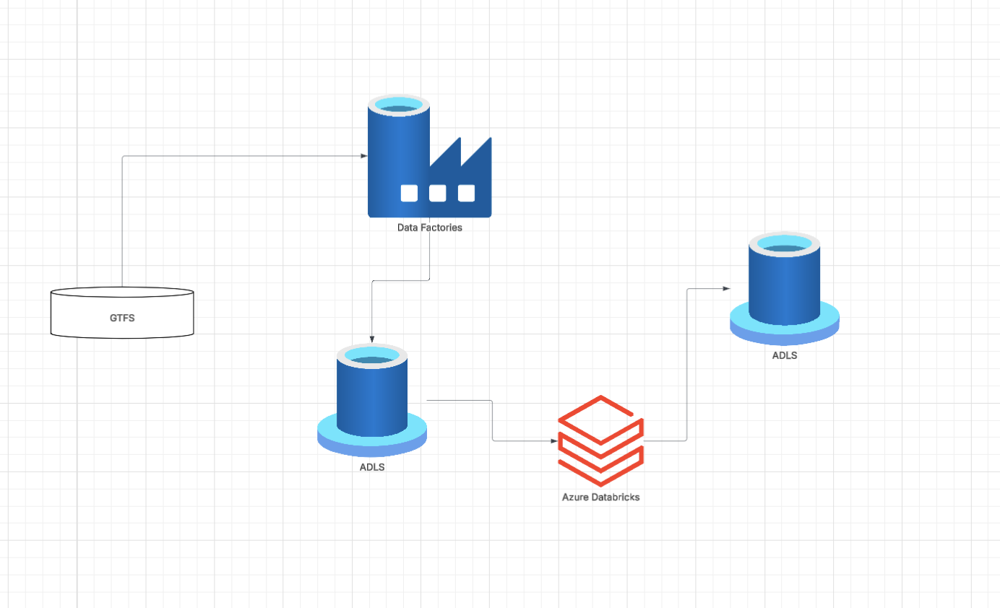
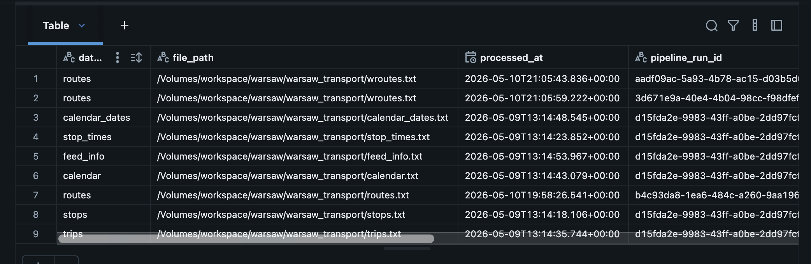
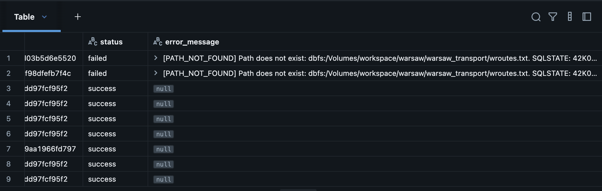
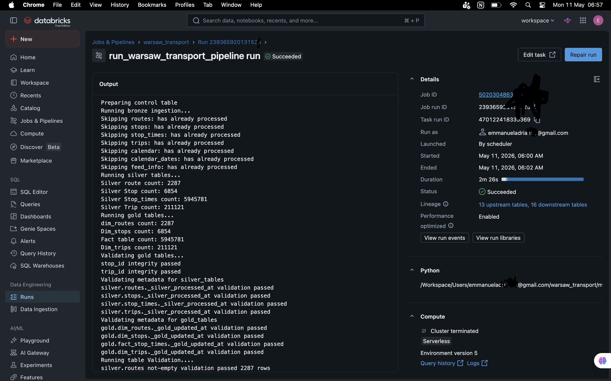
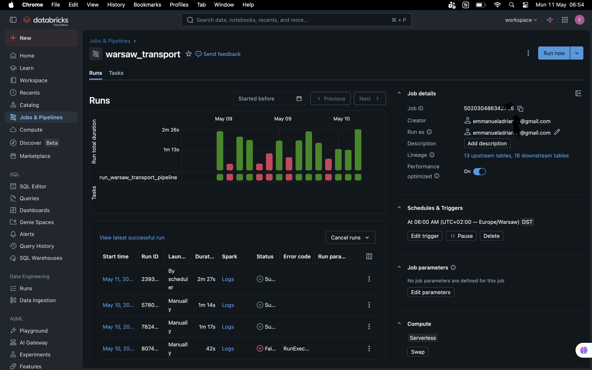

# Warsaw Public Transport ELT Pipeline 
Production style data engineering pipeline built with PysSpark, Data Lake, Databricks Workflows and Medallion Architecture to process GTFS public transport data from Warsaw.

## Project Overview
This project demonstrates the design and implementation of a modern data engineering pipeline for processing GTFS (General Transit Feed Specification) public transport data.

The pipeline follows a Medallion Architecture approach: Bronze → Silver → Gold and include 
- Incremental ingestion tracking
- Delta Lake MERGE upserts
- metadata lineage
- data quality validation
- failure logging
- automated orchestration using databricks workflows

# The goal of the project is to simulate a production-style cloud ELT pipeline using modern data engineering practices.

Production-style Medallion ELT Architecture

GTFS Files
     ↓
Bronze Layer
(raw ingestion + metadata + CDC)
     ↓
Silver Layer
(cleaning + transformations)
     ↓
Gold Layer
(dimensions + facts)
     ↓
Validation Framework
     ↓
Databricks Workflow Scheduler

# Medallion Architecture
**Bronze Layer**
The bronze layer ingests raw GTFS files directly into Delta tables.
**Features:**
- raw file ingestion
- metadata tracking
- incremental ingestion logic
- Delta MERGE upserts
- pipeline run tracking

**Metadata columns added:**

- _source_file
- _ingest_timestamp
- _pipeline_run_id

**Silver Layer**
The silver layer performs:

- cleaning
- standardization
- data transformations

**Examples:**

- route processing
- trip processing
- stop processing
- stop time normalization

**Gold Layer**

The gold layer contains dimensional warehouse models following Kimball-style modeling concepts.

**Dimension Tables**
- dim_routes
- dim_stops
- dim_trips

**Fact Table**
- fact_stop_times

The gold layer is optimized for analytics and reporting.

**Technologies Used**

- PySpark:	Distributed data processing
- Databricks: Cloud data engineering platform
- Delta Lake:	ACID transactional tables
- Unity Catalog:	Governance and metadata management
- Azure Data Lake Gen2:	Cloud storage layer
- Databricks Workflows:	Pipeline orchestration
- Python	Pipeline development:
- SQL:	Data validation and transformations

**Pipeline Features**
Incremental File Processing

Implemented a control table:

- control.processed_file

to track:

- processed files
- pipeline runs
- ingestion timestamps
- processing status
- failure history

This prevents duplicate file ingestion.

**Delta Lake MERGE (CDC / Upserts)**

Implemented Delta Lake MERGE operations for:

- routes
- stops
- trips

This enables:

- row-level updates
- new row inserts
- incremental processing

instead of full table overwrites.

**Metadata Tracking**

The pipeline captures ingestion metadata including:

- source file path
- ingestion timestamp
- pipeline execution ID

for operational lineage and auditing.

**Validation Framework**

Implemented production-style data quality validations:

- table-not-empty checks
- not-null validation
- unique key validation
- referential integrity validation

Examples:

- validating trip_id
- validating stop_id
- validating fact-to-dimension relationships
- Failure Logging

**Implemented operational failure tracking using:**

- try/except
- audit logging
- error message capture

The pipeline records:

- successful runs
- failed runs
- detailed error messages

inside the control table.

**Testing:**
Validation functions were tested using Databricks notebooks with sample Spark DataFrames 
for pass and fail cases.

**Orchestration**

The pipeline is orchestrated using Databricks Workflows.

Features:

- scheduled automatic execution
- retry handling
- workflow monitoring
- cloud-based execution

The pipeline runs automatically even when the local machine is offline.

# Project Structure
bronze/
    __init__.py
    bronze_ingestion.py

silver/
    __init__.py
    routes.py
    stops.py
    trips.py
    stop_times.py

gold/
    __init__.py
    route.py
    stop.py
    trip.py
    stop_times.py
test/
    test_validation.py

jobs/
    __init__.py
    run_silver.py
    run_gold.py

validation/
    __init__.py
    table_validation.py
    fact_validation.py

utils/
    config_loader.py
    delta_merge.py

config/
    config.yaml

main.py
README.md
requirements.txt

# Architecture Diagram

The pipeline follows a Medallion Architecture design pattern using Bronze, Silver, and Gold layers to process Warsaw GTFS public transport data.

**Pipeline flow:**
    - Raw GTFS files are ingested into the Bronze layer
    - Incremental ingestion and Delta MERGE logic handle new and updated records
    - Silver transformations clean and standardize the data
    - Gold tables implement a Kimball-style dimensional model for analytics
    - Validation checks ensure data quality and referential integrity
    - Databricks Workflows orchestrates scheduled pipeline execution

**Key production features implemented:**
    - metadata lineage tracking
    - incremental ingestion
    - Delta Lake MERGE upserts
    - failure logging
    - validation framework
    - workflow orchestration

 

# Azure Architecture

This project is designed as a cloud-native Azure data engineering pipeline.

The architecture uses Azure storage and Databricks components to process GTFS public transport data through a Medallion Architecture.

 

# Processed File Control Table 
 

# Processed File Logging Message

The pipeline implements a processed file audit framework to support incremental ingestion and operational monitoring.

A control table:

`control.processed_file`

That tracks:
    - processed file paths
    - ingestion timestamps
    - pipeline execution IDs
    - processing status (`SUCCESS` / `FAILED`)
    - error messages for failed runs

This prevents duplicate ingestion and provides historical visibility into pipeline executions and failures.

The logs below demonstrate successful and failed ingestion tracking during pipeline execution.

 

# Validation Logs

 The pipeline includes a custom validation framework to ensure data quality and warehouse consistency across the Silver and Gold layers.

 **Implemented validations include:**
    - table-not-empty checks
    - not-null validation
    - unique key validation
    - referential integrity validation between fact and dimension tables

 **This validations help ensure**
    - reliable analytics
    - consistent warehouse relationships
    - trustworthy downstream reporting

 The logs below show successful execution of validation checks during pipeline runtime.

 

# Databrick Workflow Orchestration

 The pipeline is orchestrated using Databricks Workflows with scheduled execution, retry handling, and operational monitoring.

 

# Pipeline Flow
1. GTFS files arrive
2. Bronze ingestion loads files
3. Processed-file control table prevents duplicate ingestion
4. Delta MERGE handles incremental updates
5. Silver layer performs transformations
6. Gold layer builds dimensions and facts
7. Validation framework checks data quality
8. Databricks Workflow orchestrates scheduled execution

**Built as a portfolio project to demonstrate production-style cloud data engineering concepts using Azure, Databricks and PySpark.**

